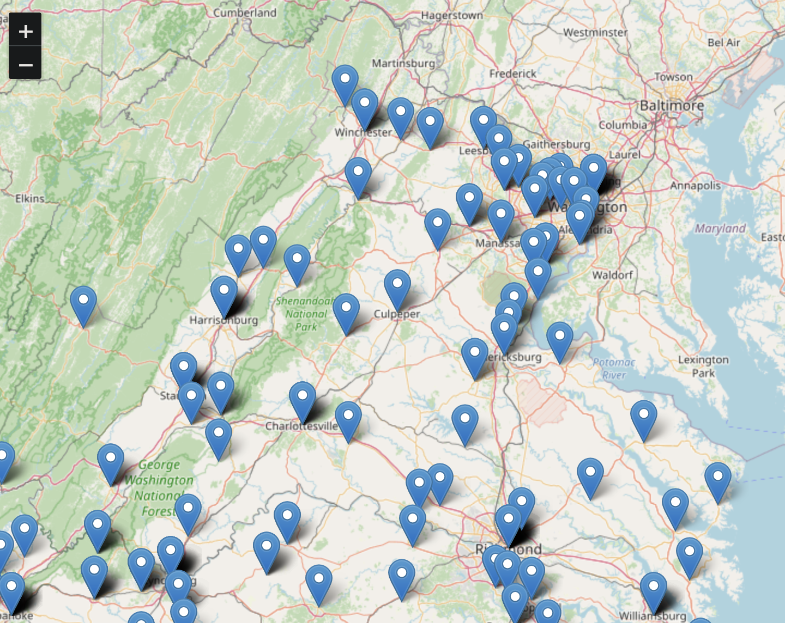

# Signal Scout - scout public radio signal anywhere!

Ham and GMRS repeaters in one map! Signal Scout aims to reduce time and effort required for radio users to select their loadout.

## Overview

Outdoor enthusiasts use handheld radios to communicate with friends, family, or even emergency services. Their tools of choice are often FRS, GMRS, or Ham radios. Although the latter two options require an FCC license to transmit, they enable operators to use repeaters, significantly increasing the transmission range of a low-power handheld radio.

Signal Scout displays both Ham and GMRS repeater locations, so operators can choose their loadout accordingly.

Signal Scout fetches open source Ham and GMRS repeater data and displays it on a Leaflet map. Each marker represents a repeater, with details shown in a popup when clicked.

## Future Imrpovements
- ~~Display all attributes for each repeater~~
- ~~Display multiple reapeaters in same location with Leaflet.markerCluster~~
- ~~Load GMRS repeater data for VA~~
- Load Ham repeater data for multiple states
- Dynamically load more repeater data
  - Store multiple state's data in local db for quick display
  - Make requests to Ham/GMRS APIs as needed when user pans/scrolls/zooms
- Enable users to see all repeater attributes if desired

## Features
- Interactive map with Leaflet.js
- Dynamic loading of local JSON data
- Markers for each repeater location
- Popup information for each marker

## Prerequisites
Before running the application, ensure you have the following installed:
- A web browser (e.g., Chrome, Firefox)
- Python (for running a local server)
  - Or Node.js (if you prefer to use `http-server`)

## Environment Setup
- source ~./bashrc
- http-server

KQ4PTJ, 73!